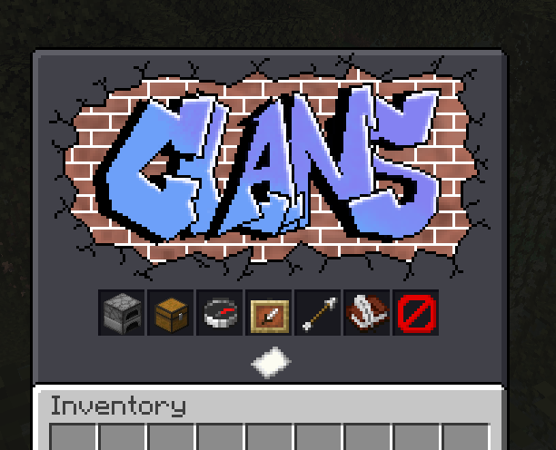

# The ultimate clans plugin
[\[preview video\]](https://www.youtube.com/watch?v=V3XsH0YFaS8)

[spigot page (download jar here)](https://www.spigotmc.org/resources/clans.135746/)

---

Let players group up to form clans and fight for the top of the leaderboard.

## Features
 - Clans can level up by burning items of value in the "furnace" GUI
 - Progress stored in SQLite database
 - Highly configurable via yaml
   - Edit GUI layouts [example](src/main/resources/gui/mainmenu.yml)
   - Configurable via config options in [config.yml](src/main/resources/config.yml)
   - Edit chat messages with [messages.yml](src/main/resources/messages.yml)
 - GUI (including optional resource pack if you want cute UI, it is free and you have my permission to merge the assets in [resourcepack/](resourcepack/) into your server's resource pack, or modify them to your liking)
 - Shared clan storage (more unlocked as your clan levels up)
 - Admin commands allowing you to manage other clans & reload the yaml files
 - Clan leaderboard
 - Command system with brigadier

## Screenshots

## Dependencies 
 - PlaceholderAPI (Not required, but the plugin does support placeholderAPI placeholders in the messages.yml & gui yml files if installed)

## Setup

1. Drag the plugin .jar file to your servers' `plugins/` directory
2. (Optional) If you would like to have the custom GUI background pngs, then you must merge the `resourcepack` folder into your servers resource pack)

## Ideas

 - Make the furnace take an item at an interval and be shared between clan members, so it's more like a real furnace slowly burning away